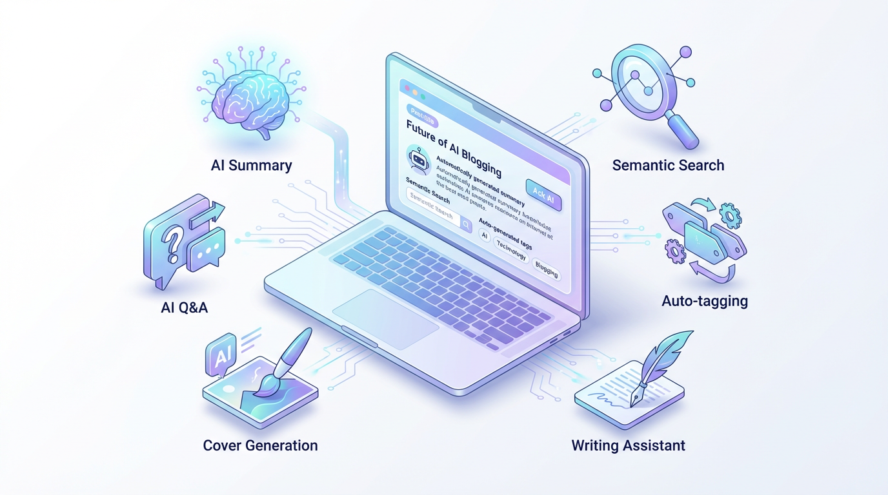
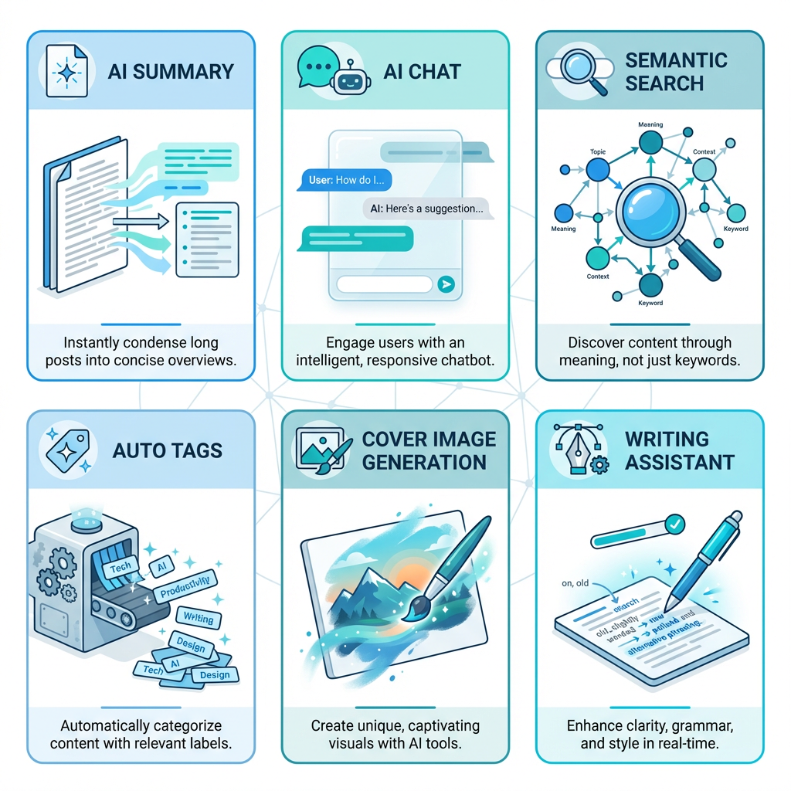
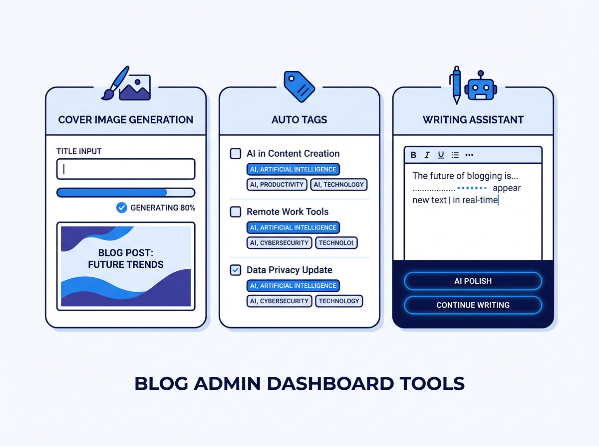
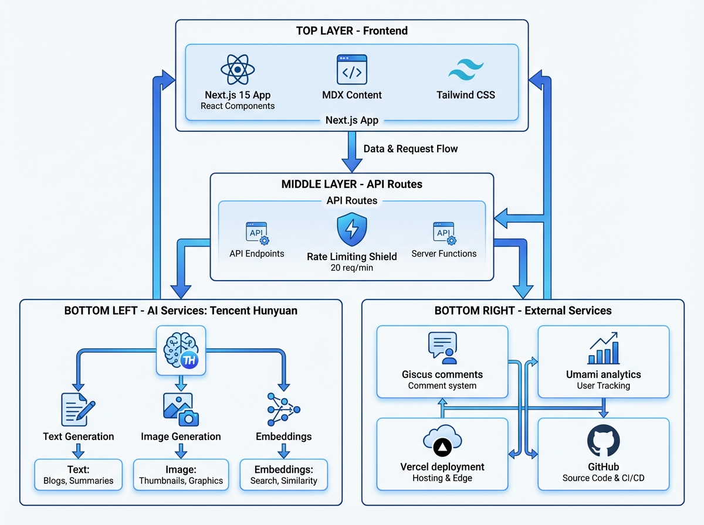

<p align="center">
  <a href="README.md">English</a> | <a href="README_zh.md">中文</a>
</p>

<p align="center">
  
</p>

# Corner430 AI Blog

A modern blog built with [Next.js](https://nextjs.org/) and [Tailwind CSS](https://tailwindcss.com/), integrated with [Tencent Hunyuan AI](https://cloud.tencent.com/document/product/1729). Based on [tailwind-nextjs-starter-blog](https://github.com/timlrx/tailwind-nextjs-starter-blog) v2, featuring 48 blog posts and a full suite of AI-powered tools.

## AI Features

<p align="center">
  
</p>

- **AI Summary** — Auto-generated article summaries with streaming output, cached in localStorage.
- **AI Q&A** — Floating chat panel for readers to ask questions about the current article.
- **Semantic Search** — Embedding-based cosine similarity search, replacing default KBar.
- **Auto Tags** — AI-suggested tags with checkbox selection and frontmatter write-back.
- **Cover Image Generation** — Async task model (submit -> poll -> preview/download).
- **Writing Assistant** — AI-powered polish and continue-writing with streaming output.

All AI features gracefully degrade when `HUNYUAN_API_KEY` is not configured. All AI API endpoints are protected by **rate limiting** (20 req/min per IP).

## UI & Reading Experience

<p align="center">
  
</p>

- **Reading Progress Bar** — Fixed scroll progress indicator at the top of article pages.
- **Floating Table of Contents** — Sidebar TOC with IntersectionObserver-based active highlighting.
- **Reading Time & Word Count** — Displayed on article listings and post pages.
- **Post Pinning** — `sticky` frontmatter field for pinning important posts to the top.
- **Copyright Declaration** — CC BY-NC-SA 4.0 notice at the bottom of every post (zh/en).
- **Page View Counter** — Per-page view count from Umami analytics.
- **Live2D Widget** — Toggleable anime character widget with localStorage persistence.
- **Click Animation** — Colored hearts float up on click.
- **Image Lightbox** — Click-to-zoom fullscreen viewer using medium-zoom.
- **Chinese Localization** — Full zh-CN translation across all UI.
- **Resources Page** — Curated learning resources organized by category (`/resources`).
- **Projects Showcase** — Project cards with covers, descriptions, and GitHub links (`/projects`).

## Admin Dashboard

<p align="center">
  
</p>

Access at `/admin` (not exposed in the navigation bar).

- **Cover Image Generation** (`/admin/cover`) — Submit generation task, poll progress, preview and download.
- **Auto Tags** (`/admin/tags`) — Browse articles, generate AI tag suggestions, write to frontmatter.
- **Writing Assistant** (`/admin/writing`) — Polish or continue-write with streaming result.

## Architecture

<p align="center">
  
</p>

| Layer         | Technology                                   | Notes                                     |
| ------------- | -------------------------------------------- | ----------------------------------------- |
| Framework     | Next.js 15 (App Router)                      | React Server Components                   |
| Language      | TypeScript                                   | Type-safe                                 |
| Styling       | Tailwind CSS 4                               | Dark/light theme support                  |
| Content       | MDX + Contentlayer                           | Markdown with embedded React components   |
| AI Text       | Tencent Hunyuan (OpenAI-compatible)          | `ai` v6 (Vercel AI SDK) + `openai` v6     |
| AI Image      | Hunyuan Image Generation (OpenAI-compatible) | Async job-based API                       |
| Rate Limiting | In-memory per-IP limiter                     | 20 req/min on all AI endpoints            |
| E2E Testing   | Playwright                                   | 16 spec files, `page.route()` API mocking |
| Unit Testing  | Jest + React Testing Library                 | 146 tests across 30 suites                |
| CI            | GitHub Actions                               | Lint + Build + Jest                       |
| Deployment    | Vercel                                       | Git push auto-deploy                      |
| Comments      | Giscus                                       | Based on GitHub Discussions               |
| Analytics     | Umami                                        | Page view tracking + counter display      |

## Writing Blog Posts

Create a `.mdx` file in `data/blog/`:

```mdx
---
title: 'My Post Title'
date: '2026-03-24'
tags: ['javascript', 'ai']
draft: false
summary: 'A brief description shown on the list page.'
sticky: 1
---

Your article content here. Supports standard Markdown and embedded React components (MDX).
```

| Field     | Description                                                                                     |
| --------- | ----------------------------------------------------------------------------------------------- |
| `title`   | Article title                                                                                   |
| `date`    | Publish date (determines sort order)                                                            |
| `tags`    | Tag array (can also be AI-generated via `/admin/tags`)                                          |
| `draft`   | Set `true` to hide from production                                                              |
| `summary` | Short description for the article list page                                                     |
| `sticky`  | Pin order (lower number = higher priority, e.g. `1` appears before `2`); omit to leave unpinned |

After writing, `git push` to `main` and Vercel will auto-deploy.

## Project Structure

```
app/
├── api/
│   ├── ai/
│   │   ├── summary/route.ts       # AI summary (streaming)
│   │   ├── chat/route.ts          # AI Q&A (streaming)
│   │   ├── search/route.ts        # Semantic search
│   │   ├── tags/route.ts          # Auto tag generation
│   │   ├── cover/submit/route.ts  # Cover image job submission
│   │   ├── cover/query/route.ts   # Cover image job polling
│   │   └── writing/route.ts       # Writing assistant (streaming)
│   ├── admin/
│   │   ├── articles/route.ts      # Read article list from data/blog/
│   │   ├── cover/write/route.ts   # Write cover image to public/
│   │   ├── login/route.ts         # Admin authentication
│   │   └── tags/write/route.ts    # Write tags to MDX frontmatter
│   ├── pageviews/route.ts         # Umami page view proxy
├── admin/
│   ├── page.tsx                   # Admin dashboard home
│   ├── cover/page.tsx             # Cover image management
│   ├── tags/page.tsx              # Tag management
│   └── writing/page.tsx           # Writing assistant
├── resources/
│   └── page.tsx                   # Curated learning resources page
components/
├── ai/
│   ├── AiSummary.tsx              # Streaming summary (with localStorage cache)
│   ├── AiChat.tsx                 # Floating Q&A panel
│   └── AiSearch.tsx               # Semantic search modal
├── ReadingProgressBar.tsx         # Scroll progress bar
├── FloatingTOC.tsx                # Floating table of contents sidebar
├── CopyrightDeclaration.tsx       # CC BY-NC-SA 4.0 copyright notice
├── PageViewCounter.tsx            # Umami page view display
├── Live2DWidget.tsx               # Live2D anime character widget
├── ImageZoom.tsx                   # Click-to-zoom image lightbox (medium-zoom)
├── ClickAnimation.tsx             # Click heart animation
├── ClientGlobalWidgets.tsx        # Client-side widget wrapper (Live2D + ClickAnimation)
data/
├── resourcesData.ts               # Curated resources data by category
└── projectsData.ts                # Project showcase data
lib/
├── hunyuan.ts                     # Hunyuan text API wrapper (OpenAI SDK)
├── hunyuan-image.ts               # Hunyuan image API wrapper (OpenAI-compatible)
├── embeddings.ts                  # Embedding index & cosine similarity utils
├── rate-limit.ts                  # In-memory rate limiter for API routes
└── utils.ts                       # Utilities (sortPostsWithSticky, etc.)
scripts/
├── generate-embeddings.mjs        # Build-time embedding index generation
├── migrate-hexo.mjs               # Hexo → MDX migration script (HTML→Markdown via turndown)
├── postbuild.mjs                  # Post-build processing
└── rss.mjs                        # RSS feed generation
docs/
└── setup-guide.md                 # Unified setup guide (Giscus, Umami, GitHub Token)
e2e/
├── helpers/mock-api.ts            # Shared API mock utilities
└── *.spec.ts                      # 16 E2E test files
```

## API Routes

| Method | Endpoint                     | Description                                        |
| ------ | ---------------------------- | -------------------------------------------------- |
| POST   | `/api/ai/summary`            | Generate article summary (streaming)               |
| POST   | `/api/ai/chat`               | Article Q&A with conversation history (streaming)  |
| POST   | `/api/ai/search`             | Semantic search via embedding cosine similarity    |
| POST   | `/api/ai/tags`               | Generate tag suggestions for article content       |
| POST   | `/api/ai/cover/submit`       | Submit cover image generation job, returns `jobId` |
| GET    | `/api/ai/cover/query?jobId=` | Poll cover image job status                        |
| POST   | `/api/ai/writing`            | Polish or continue-write article text (streaming)  |
| GET    | `/api/admin/articles`        | List all MDX articles with frontmatter and content |
| POST   | `/api/admin/tags/write`      | Write tags to an MDX file's frontmatter            |
| POST   | `/api/admin/cover/write`     | Write cover image file to public directory         |
| POST   | `/api/admin/login`           | Admin dashboard authentication                     |
| GET    | `/api/pageviews`             | Proxy to Umami analytics API for page view counts  |

## Rate Limiting

All 7 AI API endpoints (`/api/ai/*`) are protected by an in-memory rate limiter:

- **Limit**: 20 requests per minute per IP address
- **Response on exceed**: HTTP `429 Too Many Requests` with `Retry-After` header
- **Implementation**: `lib/rate-limit.ts` — lightweight, no external dependencies

## Getting Started

### 1. Install dependencies

```bash
yarn install
```

### 2. Configure environment variables

Copy `.env.example` to `.env.local`:

```bash
cp .env.example .env.local
```

See [`docs/setup-guide.md`](docs/setup-guide.md) for detailed configuration instructions covering:

- **Hunyuan API Key** — Required for all AI features (text, image, embeddings)
- **Giscus Comments** — GitHub Discussions-based comment system
- **Umami Analytics** — Page view tracking and counter display
- **GitHub Token** — For cover image write-back

AI features work without configuration — they simply degrade gracefully (return 503).

### 3. Run development server

```bash
yarn dev
```

Open [http://localhost:3000](http://localhost:3000).

## Blog Migration

Posts were originally migrated from the old Hexo blog ([corner430.github.io](https://github.com/corner430/corner430.github.io)) using `scripts/migrate-hexo.mjs`:

- Converts Hexo HTML to Markdown via [turndown](https://github.com/mixmark-io/turndown)
- Transforms Hexo frontmatter to MDX format (tags, sticky, date normalization)
- Copies post-asset images to `public/static/images/blog/`

After migration, 38 fragmented posts were consolidated into 13 comprehensive guides, and low-value posts were removed, bringing the total to 48 articles.

## Deployment

The repository is connected to [Vercel](https://vercel.com/). Every push to `main` triggers an automatic production deployment.

Set environment variables (see [`docs/setup-guide.md`](docs/setup-guide.md)) in the Vercel project settings to enable all features in production.

## CI

GitHub Actions (`.github/workflows/ci.yml`) runs on every push and pull request:

1. **Lint** — `yarn lint`
2. **Build** — `yarn build`
3. **Unit Tests** — `npx jest`

## Testing

### Unit tests (Jest)

```bash
npx jest
```

146 tests across 30 suites covering lib utilities, API routes, and React components.

### E2E tests (Playwright)

```bash
npx playwright install   # first time only
yarn e2e
```

63 tests across 16 spec files covering all pages and interactions. AI APIs are mocked via `page.route()` — no real API key needed for E2E tests.

## Build

```bash
yarn build
```

The build process includes:

1. Next.js production build (with Contentlayer)
2. Post-build processing (`scripts/postbuild.mjs`)
3. Embedding index generation (`scripts/generate-embeddings.mjs`) — skips gracefully if `HUNYUAN_API_KEY` is not set

## License

[MIT](LICENSE)
